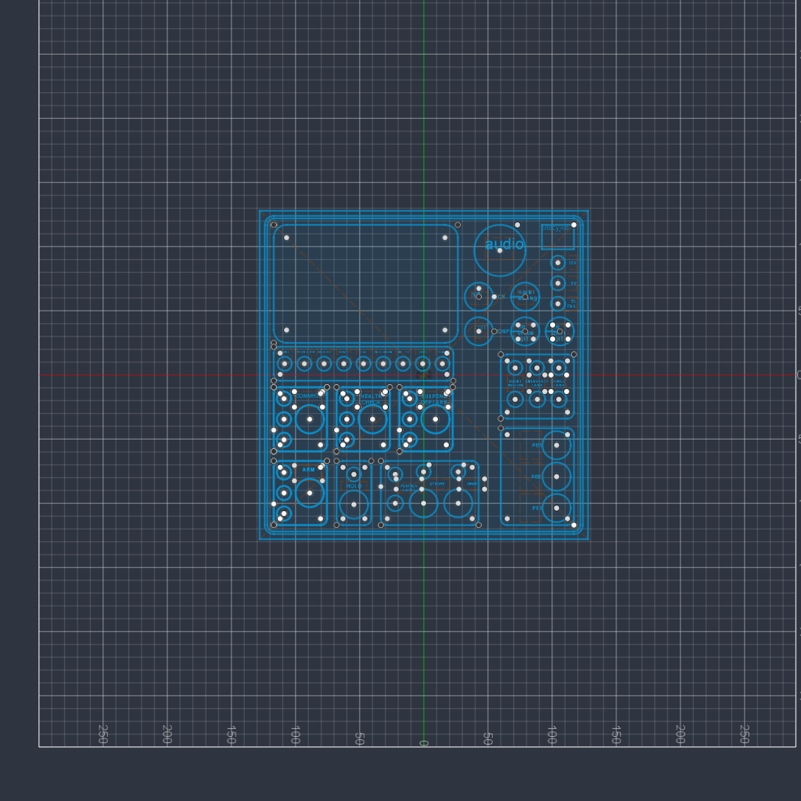
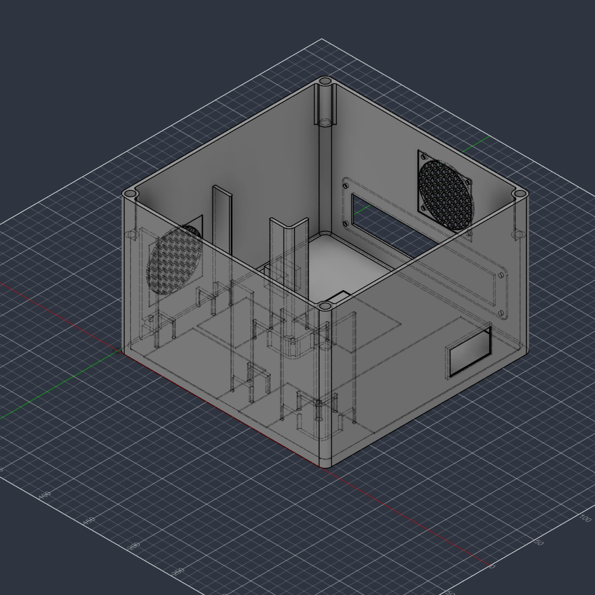
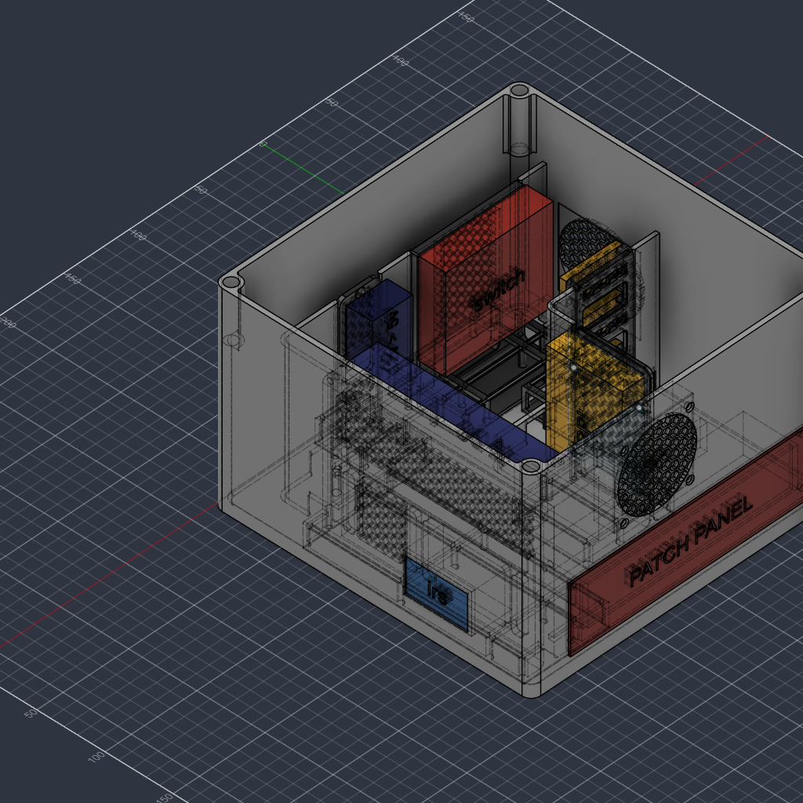

# Flight Control Console (FCC)

The **Flight Control Console (FCC)** is one subsystem of a larger **Autonomous Flight System** currently under development.

The broader project is intended to support coordinated operation of multiple semi-autonomous RC aircraft together with distributed ground infrastructure, pilot stations, communication modules, and airfield systems.

Current development is focused on the **FCC**, which acts as the central supervisory and mission-control unit of the system. It is being designed to manage aircraft missions, safety functions, telemetry, communication links, synchronization, operator interaction, and integration with supporting ground modules.

The FCC is therefore not intended to operate as a standalone controller, but as the central component of a scalable **distributed autonomous flight-control architecture**.

> **Project status:** In development.  
> The repository currently contains the FCC system concept, mechanical design, CAD files, component mounting solutions and early electronics documentation. Physical implementation and control software will be added as development progresses.

---

## System Architecture

The long-term architecture consists of several cooperating subsystems:

- Flight Control Console
- Semi-autonomous aircraft
- Pilot / manual takeover modules
- Airfield infrastructure
- Remote antenna and communication modules
- Weather and ground-support systems

The FCC acts as the main supervisory node connecting these subsystems.

---

## Current Development Scope

Current work is focused on the mechanical and electrical architecture of the FCC, including:

- Control-panel layout and operator interface planning
- FCC enclosure design
- Internal component placement
- Dedicated mounting systems for electronic modules
- Power distribution and electronics integration
- Communication interface planning

The internal layout uses simplified component models where appropriate to represent real component dimensions and reserved installation space during the mechanical design process.

---

## Repository Structure

```text
Flight-Control-Console/
├── README.md
├── docs/
│   └── images/
├── cad/
│   ├── enclosure/
│   └── mounts/
└── electronics/
    └── schematics/
```

The repository structure will expand as additional parts of the system are developed.

---

## Mechanical Design

The FCC enclosure and internal mounting system are being designed in **Autodesk Fusion**.

The mechanical design currently includes:

- Main FCC enclosure
- Front control-panel layout
- Internal component supports
- Raspberry Pi mounting
- Power-converter mounting
- I/O and switch mounting
- Cooling and ventilation provisions
- Cable-routing and service-access considerations

### Front Panel Layout

The current front-panel design defines the planned placement of controls, indicators, communication functions and operator interfaces.

At this stage, the front panel is documented as a design sketch rather than a separate production CAD file.

<p align="center">
  
</p>

### FCC Enclosure

The enclosure is being designed around the planned internal electronics and mounting requirements.

<p align="center">
  
</p>

### Internal Layout

Simplified component models are used to verify component placement, clearances and mounting geometry before physical assembly.

<p align="center">
  
</p>

---

## CAD Files

The `cad/` directory contains the current mechanical design files for the FCC enclosure and dedicated component mounts.

STEP exports are included where useful for inspection and further CAD work.

---

## Electronics

The electrical architecture is currently being developed alongside the mechanical design.

The `electronics/schematics/` directory is intended for the current FCC schematics and their exported documentation as they are completed.

Planned electrical work includes power distribution, control-panel wiring, Raspberry Pi and GPIO integration, and communication interfaces.

---

## Planned Development

The next stages of the FCC project include:

- Completion of the electrical design
- Physical manufacturing and assembly of the console
- Wiring and subsystem integration
- Control software development
- Hardware testing
- Integration with the remaining Autonomous Flight System modules

This repository represents the current engineering development state of the FCC and will be updated as the project progresses.
